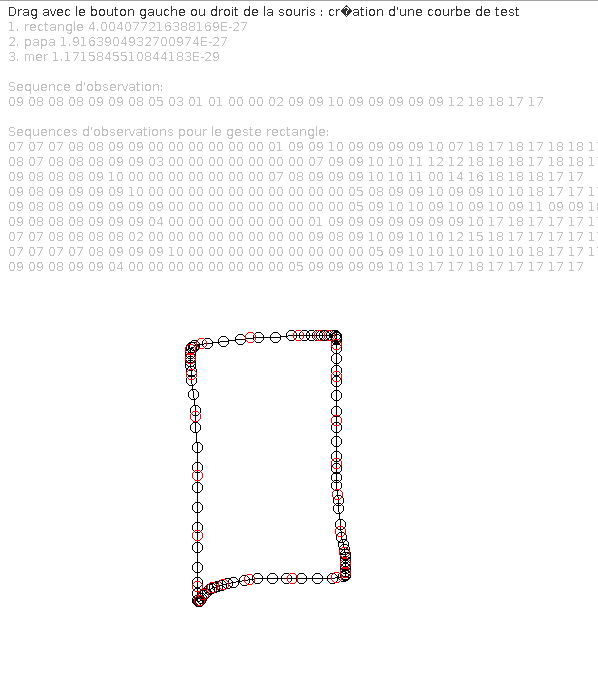

NIHM - TP : Chaînes de Markov cachées
=====================================

## Auteur

- Gaëtan DEFLANDRE

## Réponses

### Question 3

Avec cette méthode, l'angle calculé pose problème car il reste entre 0° et 180°.

### Question 4

La méthode `computeKmeansLearner` lit et crée la liste de template à partir des
modèles.  

La méthode `trainHMM``fournit les données d'apprentissage au algorithme de
reconnaissance, afin de créer la base d'apprentissage.  

### Question 7

Les scores des gestes sont faible et pas toujours correct.

### Question 8

En modifiant ces paramètres, on observe un plus ou moins forte tolérance pour
la reconnaissance de geste.

