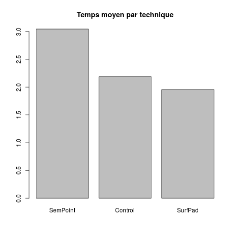
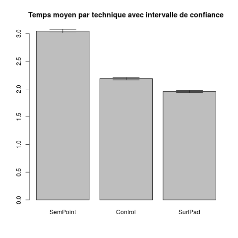
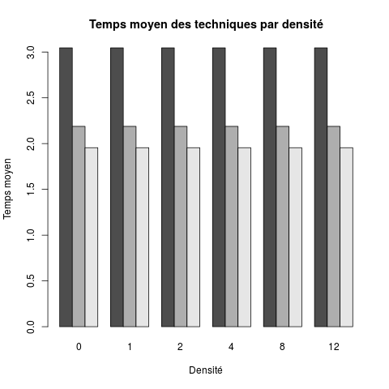
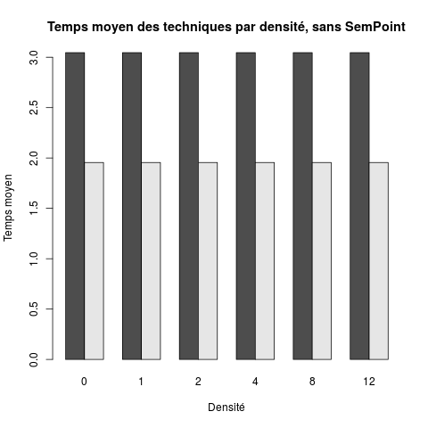

NIHM - TP Introduction à R
==========================

## Auteur

- Gaëtan DEFLANDRE

## Réponses

### Question 5

### Question 8

### Question 9

La *signification*, nous est donnée par la valeur de *p* calculée par la
fonction *ezANOVA*. Cette valeur *p* est le pourcentage de chance d'obtenir
le résultat par hasard (hypothèse nulle).  
Nous utilisons un seuil de 0.05 %, ainsi
- si p<0.05, on considère que le résultat n'est pas obtenu par hasard.
- si p>=0.05, il se peut que le résultat soit obtenu par hasard.

Ensuite, la détection des *effets* représentée par *ges* qui est, en fait,
la *puissance statistique*. Une puissance supérieure à 0.80 est considéré comme acceptable.  
Or, la puissance pour la technique est de 0.634.

Donc, l'effet significatif de Technique ne permet pas de conclure que
*Surfpad* est meilleure, mais les résultats des expériences ne sont pas
liés au hasard.

### Question 10

